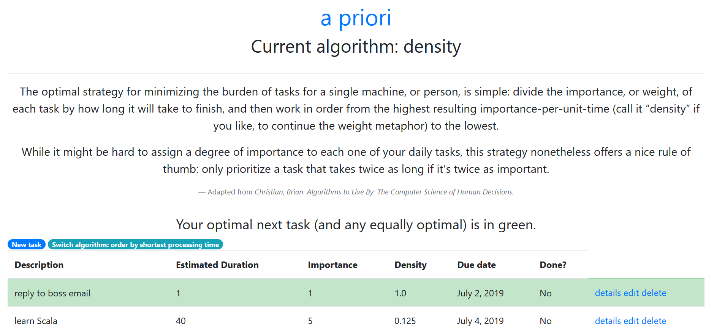

# a priori

Python Django project to optimize one-human scheduling, based on the single-machine-scheduling chapter of [Algorithms to Live By: The Computer Science of Human Decisions](https://www.amazon.co.uk/Algorithms-Live-Computer-Science-Decisions/dp/1627790365)

Optimal prioritization is cool.



## Use

### Local installation

```
git clone https://github.com/david-mears/apriori
cd apriori
python -m venv path/to/new/virtual/environment
pip install -r requirements.txt
```
Check that the virtual environment is using python 3.6 or higher.

Set the environment variables. This project doesn't need high security so I've just pasted the needed environment variable [here](https://pastebin.com/PA4KzX1a) to avoid security error messages and allow anyone to use the project. Assign APRIORI_SECRET_KEY to this value.

### Local database setup with sqlite3

Make sure your virtual environment is activated, and you are in apriori/project, then:
```
python manage.py migrate
```

This migrate command creates an empty database.

If admin site css is missing, `python3.6 manage.py collectstatic`

### Run local server

Make sure your virtual environment is activated, and you are in apriori/project, then:
```
python manage.py runserver
```

### To enable the admin side of the site

Make sure your virtual environment is activated, and you are in apriori/project, then:
```
python manage.py createsuperuser
```

Define the required details for the admin account. Anyone who can edit the source code of the website and deploy can create an admin account in this way.

## For further developing

### Getting visibility on errors

Set DEBUG=True in settings.py.